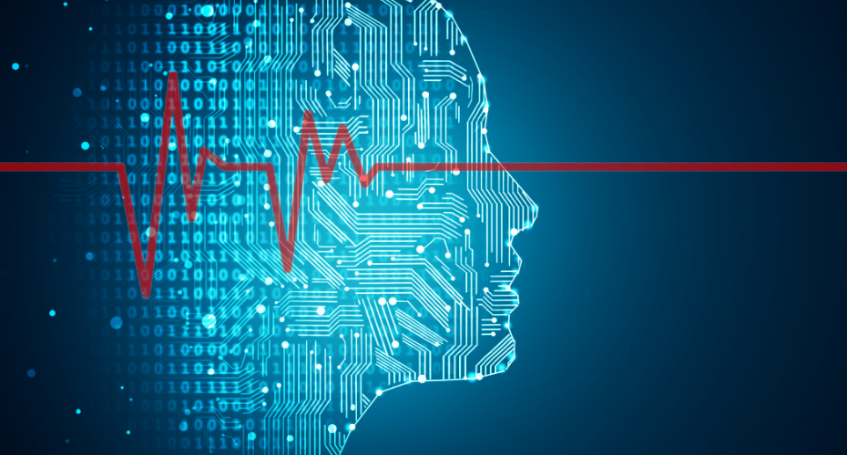

```{r pkgs, include=FALSE}
# loading packages
library(dplyr)
library(tidyr)
library(ggplot2)
```

<!-- # TODO: add better pic for titlepage  -->


# Introduction

  The 2017 Healthcare Information and Management Systems Society (HIMSS) Conference & Exhibition was one of the world’s largest and most influential healthcare IT events. Held from February 19–23, 2017 at the Orange County Convention Center in Orlando, Florida, the event brought together over 40,000 healthcare and IT professionals, including clinicians, policymakers, researchers, tech executives, industry leaders & more. With more than 1200 exhibits and hundreds of educational sessions, HIMSS 2017 served as a dynamic forum for exploring the constantly growing convergence of healthcare and technology. Key themes included cybersecurity, patient engagement, tele-medicine, and deep/machine learning integration for assistive technology, highlighting the growing need for connected and trained systems that support a rapidly growing healthcare landscape.

  Since the 2017 conference, groundbreaking technologies have emerged with the potential to alter how healthcare data is managed, analyzed, and protected. Among these, Deep Learning has shown exceptional promise in areas such as medical imaging, diagnostics, and clinical decision assistance - offering accuracy beyond normal practice. A growth in ethical tech like differential privacy - which enable the sharing and analysis of sensitive health data while preserving individual privacy — shows an increasing concern about earning user trust in the era of big data and personalized medicine. These innovations represent both technical progress and also a shift in how healthcare systems operates at massive scale while maintaining trust, security, and ethical responsibility.

  One of the key enablers behind the rise of these advanced data technologies is the significant improvement in computing infrastructure - especially through the widespread adoption of Graphics Processing Units (GPUs). Technology like NVIDIA's CUDA have transformed GPUs from gaming hardware into essential tools for scientific computing, enabling massive parallel processing that powers modern AI and machine learning applications. As the cost of computing has decreased, high-performance tools—such as dedicated GPUs—have become more accessible and standardized, even in personal and enterprise-level systems. This democratization of computing power has allowed a broader range of researchers, developers, and healthcare organizations to experiment with and deploy data-intensive solutions that were once limited to well-funded labs or tech giants.

  The focus areas of HIMSS 2017 and the emergence of next-generation information technologies point toward a radical shift for the healthcare sector. As artificial intelligence, improvements in patient privacy, and scalable data infrastructure get better, they allow the possibility of data-driven personalized care. Our report explores how these technologies are driving change across the healthcare sector - from hospital workflows and patient experience, to large-scale population health management. By analyzing data sets from HIMSS 2017, we will begin to understand how convergence of healthcare and technology is redefining the foundations of patient care.


<!-- TODO: Paragraph or two discussing what questions we want to answer specifically and why we chose them] -->


---
<!-- DATA LOAD & PREP, EDA -->

# Data Preparation

### Loading Data

```{r loadHIMSS}
# load data
HAEntity <- read.csv("data/HAEntity.csv")
HA_NPI <- read.csv("data/HAEntityNPI.csv")
UseOfIT <- read.csv("data/UseOfITComponent.csv")
Pharma <- read.csv("data/Pharmacy.csv")
PharmaProds <- read.csv("data/PharmacyProduct.csv")

# head(PharmaProds)
```

## Data Information

1. Our first collection of datasets comes directly from the HIMSS 2017 server. 

A. *HAEntity*: 

    - Description: This table contains the demographic information for all the facilities and systems tracked in the database.  (This is a self referencing table).
    
    - Link: This table links to the other tables by the 'HAEntityID'.  This table also links to itself by 'HAEntityID' to 'ParentID'.  The table linked by 'HAEntityID' will pull the IDS information and the table linked by 'ParentID' will pull the facility information.

B. *HA_NPI*:

    - Description: This table provides information reguarding medication prescriber's NPI (National Provider Identifier). 
    
    - Link: This table is connected to HAEntity by 'SurveyId' and 'HAEntityID'.

C. *Pharmacy*:

    - Description: This tables provides an overview of the pharmacy department, including FDA bar code regulations, use and planned ADMS, Robots, and EMARs.
    
    - Link: This table links to the other tables by the 'HAEntityID'.

D. *PharmacyProduct*:

    - Description: This table contains the vendor and product detail for the pharmacy department.
    
    - Link: This table links to the other tables by the 'HAEntityID'.


### Cleaning Data Column Names

```{r cleanHIMSS}
HAEntity <- HAEntity %>%
  rename(Care_Type = Type)

HA_NPI <- HA_NPI %>%
  rename(ProviderIdentifier = id)

UseOfIT <- UseOfIT %>%
  rename(Tech_Type = Type)

Pharma <- Pharma %>%
  rename(Pharma_Id = Id)

PharmaProds <- PharmaProds %>%
  rename(Pharma_Prod_Type = Type) %>%
  rename(Pharma_Prod_Id = Id)
```

### Merging Dataframes

```{r joinHIMSS}
# left join NPI to HAEntity
data <- HAEntity %>%
  left_join(HA_NPI, by = c("SurveyId", "HAEntityId")) %>%
  left_join(UseOfIT, by = c("SurveyId", "HAEntityId"))

# join Pharma/Prods
data <- data %>% 
  left_join(Pharma, by = "HAEntityId") %>%
  left_join(PharmaProds, by = "HAEntityId")

# check mismatches from splitting SurveyId cols
mismatched <- which(!is.na(data$SurveyId.y) & (data$SurveyId.x != data$SurveyId.y | data$SurveyId != data$SurveyId.y))
if (length(mismatched) == 0) {
  data <- data %>%
    select(-SurveyId, -SurveyId.y) %>%    
    rename(SurveyId = SurveyId.x)
} else {print("Corrupted SurveyId Values - Mismatch")}

colnames(data)
```

<!-- TODO: Get second dataset from Medicare or somewhere linking NPI to doctor names and specialties -->

2. The following sets come from ...


---

<!-- TODO: Regression Modeling?  -->


